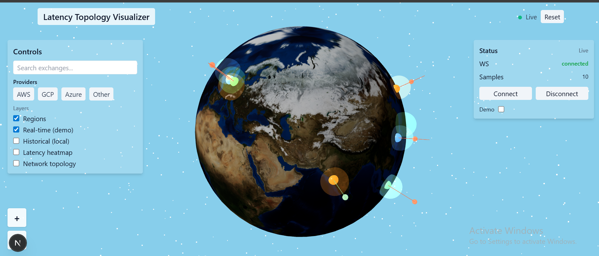
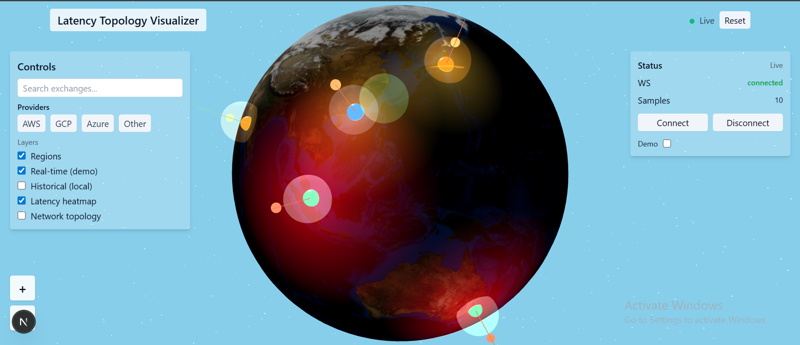
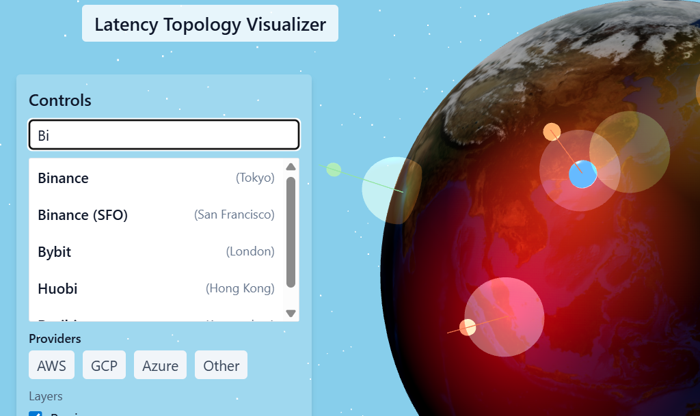
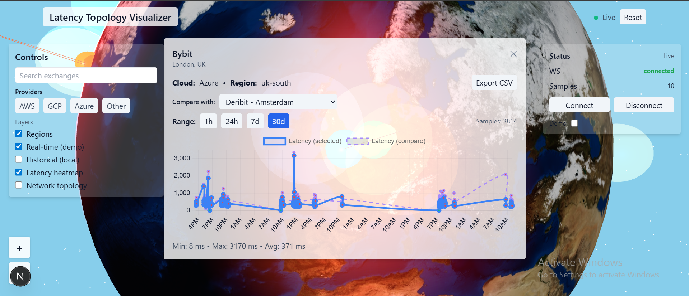

# Latency Topology Visualizer

**Latency Topology Visualizer** is a Next.js + TypeScript project that renders an interactive 3D globe to visualize cryptocurrency exchange server locations, cloud provider regions, real-time latency and historical trends. It’s built to inspect network performance quickly and intuitively with various crypto exchanges across the globe.

## Architecture & approach

Realtime latency samples are produced by a probe service and streamed over a WebSocket to the frontend. The frontend (Next.js + React + @react-three/fiber) consumes the WS stream (connectLatencyStream) and writes the latest values into a local Zustand store (latestLatency). 
All visual logic runs in the browser: arcs (exchange→region), topology (exchange↔exchange), client-side heatmap (equirectangular canvas → CanvasTexture), pulse animations, and selection/historical charts. CSV export and historical reads are handled by your existing storage helpers.

## What’s implemented

* **3D Globe & Controls** — High-fidelity globe rendered with `three.js` via `@react-three/fiber` and `@react-three/drei`. Supports smooth orbit, pan, zoom buttons, touch gestures and programmatic camera transitions.
* **Exchange Markers** — Markers plotted by lat/lng, colored by cloud provider (AWS/GCP/Azure). Clicking a marker opens a centered detail card with a time-series latency chart and CSV export.
* **Region Bubbles** — Translucent emissive bubbles placed above cloud region locations. Visibility is camera-facing gated so only front-hemisphere elements render.
* **Real-time Latency Streams** — Pluggable WS/probe adapter feeds latency into a `zustand` store (`latestLatency`). Animated arcs (exchange→region) reflect current latency and include pulsing markers to show activity.
* **Network Topology** — Exchange↔exchange edges constructed using k-nearest neighbors. Edges rendered as `THREE.Line` primitives with animated pulse spheres to indicate flow.
* **Heatmap Overlay** — Offscreen canvas draws additive radial gradients per exchange sample; mapped to a slightly larger sphere as a `CanvasTexture`. Redraws are throttled (~6 FPS) for performance.
* **Historical Trends & Exports** — `LatencyChart` supports selectable ranges (1h, 24h, 7d, 30d), with basic stats (min/max/avg) and CSV export for samples.
* **Controls & Search** — Filter by provider, toggle layers (regions/heatmap/topology), Fuse.js search, zoom controls and demo mode.

## Tech stack

Next.js, TypeScript, React, three.js, @react-three/fiber, @react-three/drei, zustand, Tailwind CSS, Fuse.js.

## Demo 

